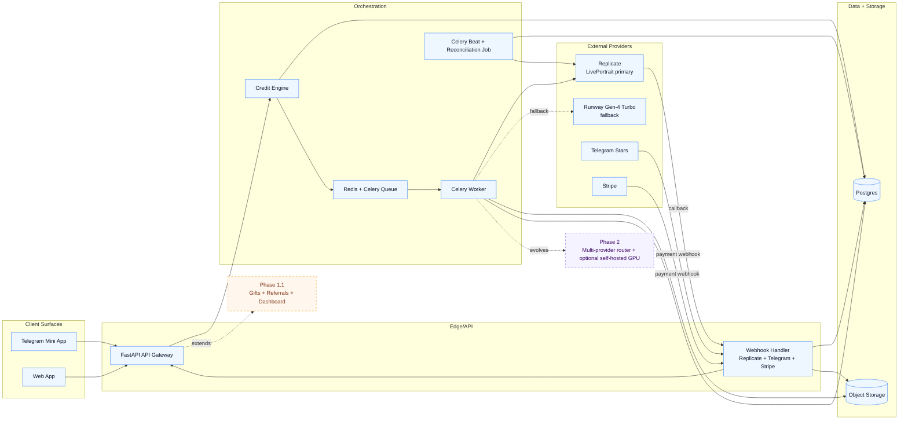
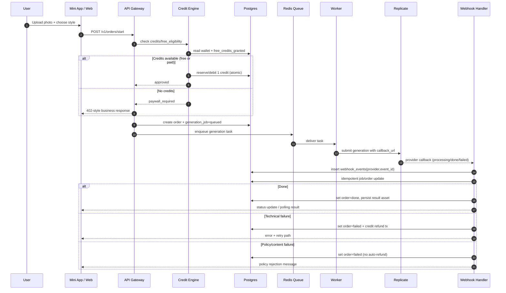

# 06 · Technical Architecture Diagrams (Mermaid)

Этот документ — канонический визуальный слой для `02_technical_architecture.md`.

## 1) System architecture (MVP + Phase markers)

## 2) Order sequence: upload → credit check → queue → callback → result/refund

## 3) Phase boundaries

- MVP: `Mini App + Web`, `FastAPI`, `Redis + Celery Workers + Celery Beat`, `Postgres`, `Object Storage`, `Replicate + Runway fallback`, `Stars + Stripe`, `Webhook + Reconciliation`.
- Phase 1.1: `Gifts`, `Referrals`, `Profile dashboards`.
- Phase 2: `Multi-provider routing`, `optional self-hosted GPU`.
