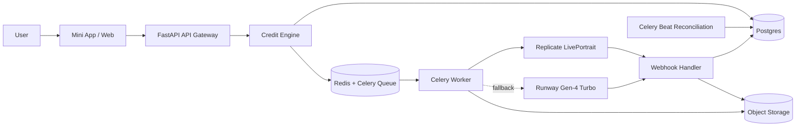

**Live Photo App**

MVP Technical Architecture Specification

v2.0 · Mini App + Web · Queue-backed MVP with DB source of truth

**0. Цель и принцип**

MVP отвечает на вопрос: пользователи стабильно переходят из 1 free generation в покупку пакетов 5/20/50?

> **Главный принцип**
>
> Загрузить фото → проверить кредит/free → поставить в очередь → сгенерировать видео → доставить результат → вернуть пользователя в повторный цикл.

Архитектурный паттерн: webhook-driven + queue-backed MVP с DB-backed state.

**1. Финальный технический стек (locked)**

| **Слой** | **Инструмент** | **Фаза** | **Обоснование** |
|---|---|---|---|
| **Клиент** | Telegram Mini App + Web (React + TS) | **MVP** | Единая IA и логика для двух поверхностей |
| **API** | FastAPI + Python 3.12 | **MVP** | Быстрый backend + webhook endpoints |
| **Очередь** | Redis + Celery | **MVP** | Надёжнее in-process задач, проще масштабируется |
| **Планировщик** | Celery Beat | **MVP** | Reconciliation и периодические задачи |
| **БД** | Postgres | **MVP** | Источник истины по статусам/платежам/кредитам |
| **Файлы** | S3-compatible Storage | **MVP** | Source/result media + signed access |
| **AI primary** | Replicate LivePortrait | **MVP** | Быстрый запуск без своей GPU-инфры |
| **AI fallback** | Runway Gen-4 Turbo | **MVP** | Резерв по доступности и SLA |
| **Платежи primary** | Telegram Stars | **MVP** | Нативный канал в Telegram |
| **Платежи fallback** | Stripe | **MVP** | Web и регионы без Stars |
| **Мониторинг** | Sentry + structured logs | **День 1** | Ошибки, трассировка, метрики |
| **NSFW** | AWS Rekognition | **День 1** | Блок на входе до генерации |

**2. Архитектурная схема (актуальная)**

**3. Канонические сущности БД (MVP + Phase 1.1)**

MVP core:

- users
- wallets
- wallet_transactions
- packages
- payments
- orders
- generation_jobs
- media_assets
- webhook_events

Phase 1.1 extension:

- referrals
- gift_packages

Подробная ER-диаграмма: `specs/07_database_er_diagram.md`.

**4. Продуктовый flow (MVP)**

| **Шаг** | **Пользователь** | **Система** |
|---|---|---|
| 1 | Onboarding | before/after + trust-copy |
| 2 | Upload | валидация + NSFW + save source |
| 3 | Style pick | превью + выбор стиля |
| 4 | Credit check | free credit → paid wallet → paywall |
| 5 | Paywall | пакет 5/20/50 через Stars/Stripe |
| 6 | Processing | queued → submitted → processing |
| 7 | Result | done/failed + refund policy |
| 8 | History/Profile | повторная генерация и retention-логика |

**5. Webhook + queue flow**

1. API создаёт `order(draft)` и `generation_job(queued)`.
2. Credit engine атомарно списывает 1 кредит (или free).
3. Celery worker отправляет задачу провайдеру с callback URL.
4. Webhook handler записывает событие в `webhook_events(provider,event_id)`.
5. Если событие новое — обновляет job/order, сохраняет result media.
6. При technical failure выполняет `refund_generation +1`.
7. Celery Beat reconciliation проверяет зависшие jobs и дожимает статус.

**6. Guardrails (locked)**

Технические:

- max file size: 10 MB
- mime: image/jpeg, image/png
- resize to 1024px before generation
- timeout job: 15 minutes
- retry: 2 для transient network/provider errors
- retry: 0 для policy/content failures
- webhook dedup: только через `webhook_events`

Продуктовые:

- SLA-copy: обычно 40–180 секунд
- privacy retention: source 48h, result 30d
- policy: no NSFW, no чужие фото, no знаменитости
- честный дисклеймер: результат может отличаться от превью

**7. Тарифная модель (locked)**

- 1 generation = 1 credit
- 1 free generation per user_id
- 3 пакета: 5 / 20 / 50
- pricing model: x2..x3 от `base_gen_usd`
- launch baseline: `base_gen_usd=0.25`, multipliers `S=3.0`, `M=2.6`, `L=2.2`

Подробно: `specs/08_tariff_spec.md`.

**8. Структура кода (target)**

- `apps/client-mini-web/` — единый frontend
- `apps/api/` — FastAPI + webhooks + domain services
- `workers/celery/` — generation + reconciliation tasks
- `db/` — models, migrations, repositories
- `infra/` — env templates, observability, deploy scripts

**9. Roadmap**

| **Фаза** | **Что** |
|---|---|
| **MVP** | Mini App + Web, Celery stack, credits, 5/20/50 packages |
| **Phase 1.1** | Gifts + referrals + profile dashboards |
| **Phase 2** | provider routing optimization + optional self-hosted GPU |

**10. TL;DR**

MVP больше не single-surface и не in-process-task-only.

Финальный контур: Mini App + Web + FastAPI + Redis/Celery + Postgres + Object Storage + Replicate/Runway + Stars/Stripe + строгая идемпотентность через `webhook_events`.
