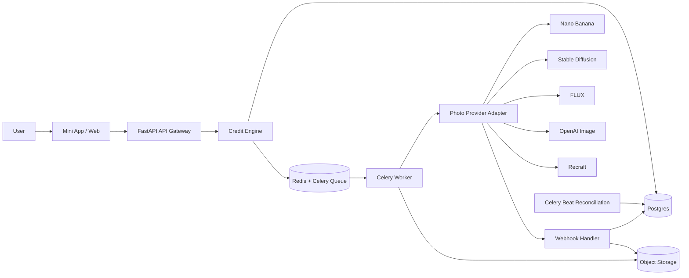

**Persona**

MVP Technical Architecture Specification

v3.0 · Mini App + Web · Queue-backed MVP with DB source of truth

**0. Цель и принцип**

MVP отвечает на вопрос: пользователи стабильно переходят из `1 free generation` в покупку пакетов `150/350/800/2000/5000`?

> **Главный принцип**
>
> Выбрать стиль/модель → загрузить фото → проверить кредит/free → поставить в очередь → сгенерировать фото → доставить результат → вернуть пользователя в повторный цикл.

Архитектурный паттерн: webhook-driven + queue-backed MVP с DB-backed state.

**1. Финальный технический стек (locked)**

| **Слой** | **Инструмент** | **Фаза** | **Обоснование** |
|---|---|---|---|
| **Клиент** | Telegram Mini App + Web (React + TS) | **Phase 1** | Единая IA и логика для двух поверхностей |
| **API** | FastAPI + Python 3.12 | **Phase 1** | Быстрый backend + webhook endpoints |
| **Очередь** | Redis + Celery | **Phase 1** | Надёжнее in-process задач, проще масштабируется |
| **Планировщик** | Celery Beat | **Phase 1** | Reconciliation и периодические задачи |
| **БД** | Postgres | **Phase 1** | Источник истины по статусам/платежам/кредитам |
| **Файлы** | S3-compatible Storage | **Phase 1** | Source/result media + signed access |
| **AI providers** | Nano Banana / SD / FLUX / OpenAI Image / Recraft | **Phase 1** | Official-only photo providers |
| **Платежи primary** | Telegram Stars | **Phase 1** | Нативный канал в Telegram |
| **Платежи fallback** | Stripe | **Phase 1** | Web и регионы без Stars |
| **Мониторинг** | Sentry + structured logs | **День 1** | Ошибки, трассировка, метрики |
| **NSFW** | AWS Rekognition | **День 1** | Блок на входе до генерации |

**2. Архитектурная схема (актуальная)**

**3. Канонические сущности БД (MVP + Phase 1.1)**

MVP core:

- users
- wallets
- wallet_transactions
- packages
- payments
- orders
- generation_jobs
- media_assets
- webhook_events

Phase 1.1 extension:

- referrals
- gift_packages

**4. Guardrails (locked)**

Технические:

- max file size: 20 MB
- mime: image/jpeg, image/png
- resize to 1024px before generation
- timeout job: 15 minutes
- retry: 2 для transient network/provider errors
- retry: 0 для policy/content failures
- webhook dedup: только через `webhook_events`

Продуктовые:

- SLA-copy: обычно 30–120 секунд
- privacy retention: source 48h, result 30d
- пользователь загружает только фото (video/animation out of scope)
- policy: no NSFW, no чужие фото, no знаменитости
- честный дисклеймер: результат может отличаться от превью

**5. Тарифная модель (locked)**

- 1 free generation per user_id
- model-priced generation: 10–40 🪙
- 5 пакетов: 150 / 350 / 800 / 2000 / 5000

Подробно: `specs/08_tariff_spec.md`.

**6. Roadmap**

| **Фаза** | **Что** |
|---|---|
| **Phase 1** | Photo sessions MVP + 5 providers + Stars economy |
| **Phase 1.1** | Gifts + referrals + profile dashboards |
| **Phase 2** | AI animation/video + provider routing optimization |

**7. TL;DR**

Phase 1 = photo-first only. Анимация и видео зафиксированы как Phase 2.
